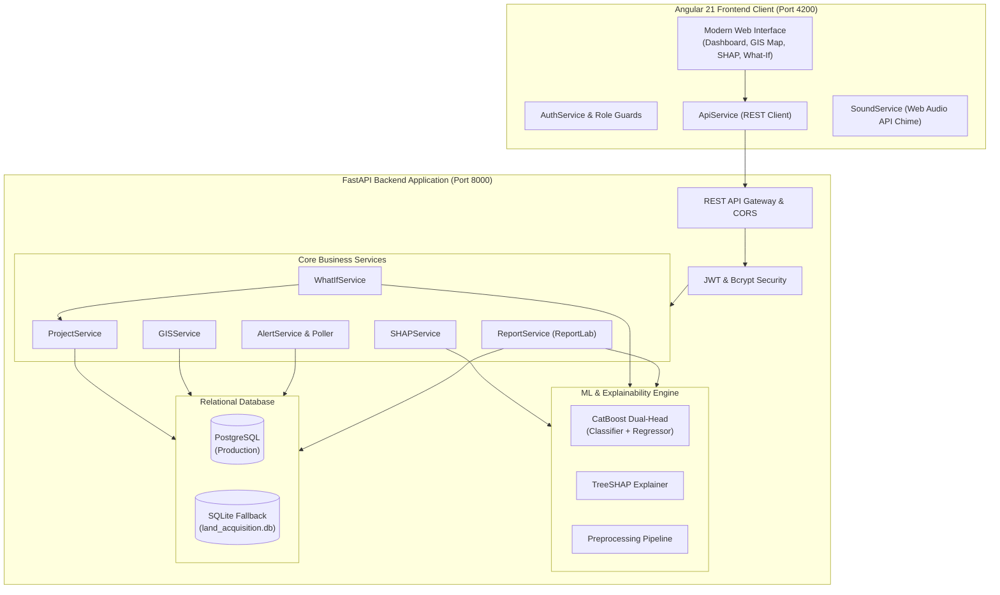

# System Architecture & Technical Specifications (SIH26017)
**Team**: NEXORA_TAU  
**Project**: Predictive Analytics System for Early Detection of Land Acquisition Delays (SIH26017)

---

## 1. High-Level Architecture Overview

The system is designed with a decoupled, enterprise/government-grade architecture adhering to Indian statutory land acquisition frameworks (RFCTLARR Act 2013) and PM-GatiShakti spatial integration standards.

---

## 2. Core Subsystems

### 2.1 Angular 21 Presentation Layer
- **Framework**: Angular 21 with Standalone Components and native Signals (`signal`, `computed`).
- **Styling**: SCSS conforming to the reference SIH Solution Workflow mockup with indigo/violet accents and clean card layouts.
- **Mapping**: Interactive Leaflet / OpenStreetMap integration with custom HTML marker pins color-coded by statutory risk:
  - 🔴 **High Risk**: $\ge 60$ Days delay or critical legal/procedural injunctions.
  - 🟡 **Medium Risk**: $20$ to $59$ Days delay.
  - 🟢 **Low Risk**: $< 20$ Days delay / On Schedule.
- **Single Source of Truth**: All metrics, project lists, risk charts, and alerts are fetched dynamically from the FastAPI backend. No duplicate numbers in templates.

### 2.2 Audio Notification Safety Policy (Web Audio API)
- Standard HTML5 `<audio>` autoplay is blocked by modern browser security policies (Chrome, Edge, Firefox).
- The prototype uses the **Web Audio API** via `SoundService`:
  - Synthesizes a two-tone warning chime ($880\text{ Hz} \to 659.25\text{ Hz}$ harmonic decay) natively in browser memory.
  - Initialized upon explicit user interaction or login.
  - **Safety Rule**: Sound chime is fired **once only** per newly arrived, unacknowledged high-risk alert. It never loops or repeats annoyingly.
  - Fully toggleable in Settings and persistent in `localStorage`.

### 2.3 FastAPI Application & Database Engine
- **Framework**: FastAPI (Python 3.13) with asynchronous request handlers.
- **ORM & Database**: SQLAlchemy 2.0 with connection pooling.
  - Seamless auto-fallback: Attempts connection to PostgreSQL; if unavailable, immediately falls back to local SQLite database (`sqlite:///./land_acquisition.db`).
- **Authentication**: JWT Bearer token authentication with bcrypt password hashing.

### 2.4 ML & TreeSHAP Attribution Engine
- **Model**: CatBoost Dual-Head GBDT (Classifier F1: 0.9216, Regressor $R^2$: 0.9554).
- **Explainability**: TreeSHAP with real-time attribution waterfall into 8 canonical RFCTLARR statutory factors.
- **What-If Simulator**: Real-time slider adjustments (dispute resolution, staff deployment, circle rate premium) dynamically recalculate delay days, risk probability, and financial savings.

### 2.5 Statutory PDF Report Generator
- Implemented with **ReportLab**.
- Generates official government-formatted PDF dossiers containing project metadata, seal, delay metrics, 8 canonical factor breakdown, and Standard Operating Procedure (SOP) recommendations.
