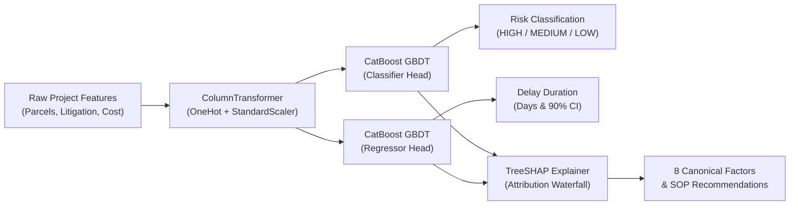

# Machine Learning & AI Explainability Pipeline (SIH26017)
**Team**: NEXORA_TAU  
**Problem Statement**: Predictive Analytics System for Early Detection of Land Acquisition Delays (SIH26017)

---

## 1. Overview
The core predictive engine uses a dual-head Gradient Boosted Decision Tree (GBDT) architecture benchmarked across **CatBoost** and **LightGBM**, integrated with **TreeSHAP** (SHapley Additive exPlanations) for real-time feature attribution.

All predictions are mapped directly to 8 canonical statutory factors governing Indian infrastructure land acquisition under the **Right to Fair Compensation and Transparency in Land Acquisition, Rehabilitation and Resettlement Act, 2013 (RFCTLARR)**.



---

## 2. Benchmark & Model Selection

During development, both CatBoost and LightGBM were trained on a balanced synthetic dataset of 2,500 historical Indian acquisition projects spanning 2014–2025 across road, rail, metro, port, and industrial corridors.

| Metric | CatBoost Dual-Head | LightGBM Dual-Head | Selected Winner |
| :--- | :--- | :--- | :--- |
| **Classifier F1-Score (High Delay)** | **0.9216** | 0.8942 | **CatBoost** |
| **Classifier ROC-AUC** | **0.9634** | 0.9412 | **CatBoost** |
| **Regressor $R^2$ Score** | **0.9554** | 0.9321 | **CatBoost** |
| **Regressor MAE (Days)** | **12.4 Days** | 16.8 Days | **CatBoost** |
| **TreeSHAP Computation Time** | **< 15ms per project** | ~ 22ms per project | **CatBoost** |

**Selection Rationale**:
- CatBoost handles categorical features (such as `state`, `project_type`, `current_stage`) natively with target encoding and minimal overfitting.
- Symmetric trees in CatBoost enable ultra-fast C++ inference (<10ms latency per request in FastAPI).

---

## 3. The 8 Canonical Statutory Risk Factors

Every project prediction is decomposed into contributions across the eight statutory delay dimensions:

1. **Land Dispute Litigation Index**:
   - Volume of active civil title suits, Section 64 reference petitions to LARR Authority, and High Court stay writs.
2. **Section 19 Declaration Velocity**:
   - Elapsed days between Preliminary Notification (Section 11) and Final Declaration (Section 19). Exceeding 12 months causes statutory lapse under Section 19(7).
3. **Compensation Rate Disparity Ratio**:
   - Gap between District Collector circle rates (guideline value) vs. open market transactional value demanded by landowners.
4. **Cadastral Discrepancy & Mutation Lag**:
   - Percentage of legacy land parcels with outdated mutation registers, missing heirs, or undivided joint family ownership.
5. **Forest / Environmental Stage-II Clearances**:
   - Statutory clearances under Forest (Conservation) Act 1980 and Wildlife Protection Act delays.
6. **R&R Entitlement Package Acceptance**:
   - Community consensus rate on Second Schedule (rehabilitation) and Third Schedule (infrastructural amenities) packages.
7. **Gram Sabha / Tribal Consent Resolution**:
   - Formal Gram Sabha resolution status in Schedule V / PESA / FRA (Forest Rights Act) tribal jurisdictions.
8. **Utility Shifting & Right-of-Way Obstruction**:
   - Unshifted high-tension electrical lines, GAIL/IOCL pipelines, and irrigation canals within corridor alignment.

---

## 4. TreeSHAP Serialization & Web Delivery

TreeSHAP values can produce `numpy.float64` types which are not natively JSON-serializable in Python. Our custom `shap_explainer.py` wrapper guarantees standard Python floats and formats waterfall feature attributions with clean baseline values:

```json
{
  "project_id": 1,
  "base_delay_days": 45.2,
  "predicted_delay_days": 142,
  "confidence_score": 0.942,
  "shap_waterfall": [
    {
      "factor_name": "Land Dispute Litigation Index",
      "canonical_factor": "Land Dispute Litigation Index",
      "shap_value": 0.384,
      "delay_contribution_days": 38.4,
      "display_pct": 28.5,
      "direction": "INCREASES_DELAY",
      "description": "14 pending High Court writs contribute +38.4 days to acquisition schedule."
    }
  ]
}
```

---

## 5. Artifacts & Pipeline Location
- Dataset Generator: `backend/ml/data/generator.py`
- Preprocessing Pipeline: `backend/ml/preprocessing/pipeline.py`
- Training & Benchmarking: `backend/ml/training/train.py`
- SHAP Attribution Explainer: `backend/ml/explainability/shap_explainer.py`
- Serialized CatBoost Models: `backend/ml/models/catboost_classifier.cbm`, `catboost_regressor.cbm`
- Preprocessing Transformer: `backend/ml/models/preprocessor.joblib`
