# SIH Solution Workflow Guide (SIH26017)
**Team**: NEXORA_TAU  
**Reference Document**: "SIH SOLUTION WORKFLOW – LAND ACQUISITION DELAY PREDICTION SYSTEM"

---

## 1. End-to-End Judge & Evaluator Workflow

This application implements the 6 core operational stages outlined in the primary SIH workflow specification:

```mermaid
flowchart LR
    A["1. Secure Login\n(Demo Auth / SSO)"] --> B["2. Dashboard\n(KPIs & Risk Overview)"]
    B --> C["3. GIS Risk Map\n(Spatial Red/Yellow/Green)"]
    C --> D["4. Project Details\n(Top 8 Risk Factors)"]
    D --> E["5. AI Explainability\n(TreeSHAP Waterfall)"]
    E --> F["6. Recommendations\n& What-If Simulator"]
    F --> G["7. Real-Time Alerts\n& Safety Chime"]
    G --> H["8. Statutory Reports\n(PDF / JSON Export)"]
```

---

## 2. Step-by-Step Stage Verification

### Stage 1: Role-Based Secure Login
- **Route**: `/login`
- **Demo Accounts**:
  - `Revenue Officer`: `officer@gov.in` / `Password123!`
  - `Data Analyst`: `analyst@gov.in` / `Password123!`
  - `Super Admin`: `admin@gov.in` / `Password123!`
- **SSO Mock Options**: National Single Sign-On (Jan Parichay) and DigiLocker integrations.

### Stage 2: Executive Dashboard
- **Route**: `/dashboard`
- **KPI Metrics**: Total Projects, Land Parcels Monitored, High Risk Projects, Average Predicted Delay Days, Acquisition Progress %.
- **Project Risk Overview Chart**: Strict compliance rule: **NO Critical Risk** category is shown. Only High Risk (Red), Medium Risk (Yellow/Amber), and Low Risk (Green).
- **Recent Projects Table**: Real-time project records with direct navigation to detailed dossiers.

### Stage 3: Interactive GIS Risk Map
- **Route**: `/gis-map`
- **Mapping Engine**: Leaflet + OpenStreetMap with smooth pan/zoom over India.
- **Color-Coded Custom Pins**:
  - 🔴 Red: High Risk ($\ge 60$ days delay)
  - 🟡 Yellow: Medium Risk (20–59 days delay)
  - 🟢 Green: Low Risk (< 20 days delay)
- **Interactive Popup**: Project name, delay duration, cost impact, and "Inspect Project" button.

### Stage 4: Project Risk Details
- **Route**: `/projects/:id`
- **Comprehensive Dossier**: Acquisition progress bar, RFCTLARR statutory stage, daily delay cost burn rate, total parcels, and affected families.
- **Top 8 Statutory Risk Factors**: Detailed percentage contribution, severity badge, and factual evidence (e.g. 14 High Court writ petitions).

### Stage 5: AI Explainability (TreeSHAP Waterfall)
- **Route**: `/shap` (preserves `?projectId=:id` context)
- **Horizontal Waterfall Chart**: Visualizes exact baseline $+ \text{SHAP contribution} = \text{Predicted Delay}$.
- **Attribution Breakdown**: Positive contributions (red) increase delay; negative contributions (green) mitigate delay.

### Stage 6: Recommendations & What-If Simulator
- **Route**: `/what-if` (preserves `?projectId=:id` context)
- **Interactive Parameter Sliders**:
  - Dispute Resolution Acceleration (%)
  - Additional Revenue Staff Assigned (Surveyors/LARR officers)
  - Land Compensation Rate Revision (%)
  - Forest / Environmental Clearance Fast-Track
  - Enhanced R&R Housing Package
- **Live Recalculation**: Post-intervention delay days, days saved, new risk score, and financial savings in ₹ Crores.
- **SOP Directives**: Actionable statutory guidance mapped to Indian administrative rules.

### Stage 7: Real-Time Alerts & Web Audio Chime
- **Route**: `/alerts`
- **15-Second Poller**: Automated client polling to detect newly escalated delay risks.
- **Sound Safety Policy**: Built with Web Audio API. Warning chime triggers **once only** per newly arrived unacknowledged high-risk alert. Never loops or repeats.
- **Acknowledge Action**: Revenue Officer marks alert acknowledged, silencing future chimes for that event.

### Stage 8: Statutory Reports & Cadastral Records
- **Route**: `/reports` & `/land-records`
- **PDF Generation**: Generates official ReportLab PDF dossiers with seal, delay metrics, and recommendations.
- **Cadastral Inventory**: Granular Khasra-level tracking with ownership, dispute status, and compensation progress.
